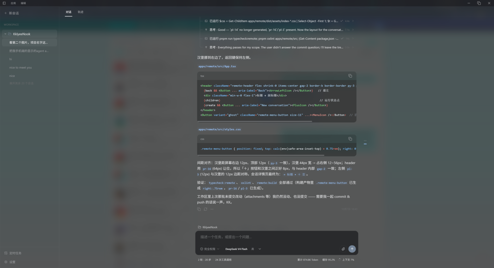
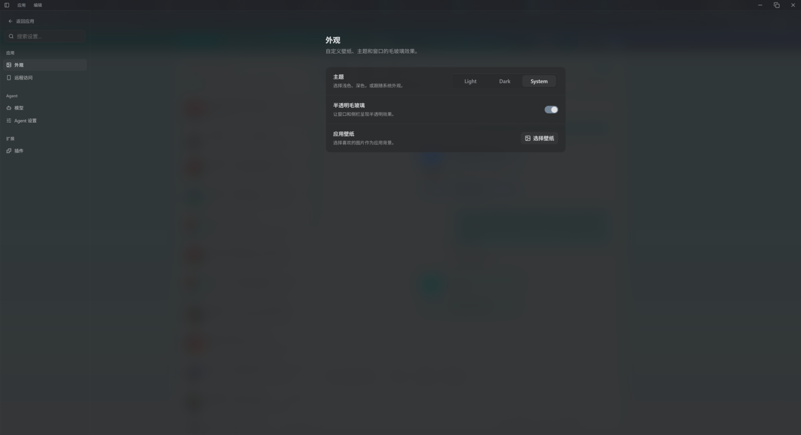
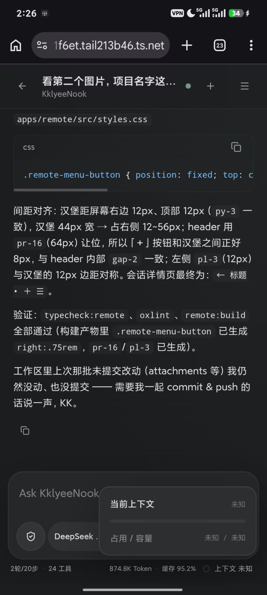

# KklyeeNook

基于 **pi SDK** 的开源桌面 **AI Agent**，集成代码执行、项目会话、知识检索与移动端远程访问能力。

KklyeeNook 使用 Electron、React 和 TypeScript 构建，结合 [pi](https://github.com/earendil-works/pi) 的会话与模型能力，以及 [assistant-ui](https://www.assistant-ui.com/) 的聊天组件。你可以在电脑上围绕本地项目与 Agent 协作，也可以通过 Remote 在手机上继续同一个会话、查看任务进度和处理审批。

## 界面预览

桌面会话与 Agent 执行活动、外观设置，以及 Remote 手机端聊天。

<table>
  <tr>
    <th>桌面端</th>
    <th>外观设置</th>
    <th>Remote 手机端</th>
  </tr>
  <tr>
    <td></td>
    <td></td>
    <td></td>
  </tr>
</table>

## 核心功能

| 功能 | 能力 |
| --- | --- |
| **pi 驱动的 Agent** | 持久化会话、流式回复、工具调用、模型与 Thinking 切换、自动和手动上下文压缩 |
| **Workspace 与项目会话** | 将本地目录绑定为工作区，按项目组织会话，为工具提供对应的执行目录 |
| **代码与文件操作** | 读取、写入、编辑、查找文件、搜索内容和执行 Shell；在侧边预览代码、Markdown、图片与 Diff |
| **Remote 移动端访问** | 通过 Tailscale 私网使用移动端 PWA，共享桌面的项目、pi 会话和任务状态 |
| **运行中交互与 Queue** | 发送 Steer 调整当前执行方向，发送 Follow-up 排队后续任务，编辑队列消息或停止运行 |
| **Subagent 与执行记录** | 委派独立子任务，查看计划、工具活动和运行历史；最多同时运行两个子任务，子任务不再继续委派 |
| **权限与审批** | 提供只读、工作区内修改和完全权限三种模式，支持临时授权及桌面、手机审批 |
| **Skills 与 MCP** | 加载本地 `SKILL.md`，连接基于 stdio 的 MCP Server，将外部工具接入 Agent |
| **Memory 长期记忆** | 保存全局和工作区记忆，在后续任务中作为上下文使用，并在设置中管理 |
| **Knowledge 本地知识库** | 导入文档、文件夹和工作区，结合全文与向量检索、重排、OCR 和可追溯引用 |
| **Web Search** | 配置 Tavily 或 Exa，为 Agent 提供联网搜索能力 |
| **定时任务** | 按单次、每日或每周计划运行 prompt，可关联会话和 Skills；需要应用保持运行 |
| **桌面外观** | 浅色、深色和跟随系统主题，自定义壁纸与半透明毛玻璃效果 |

## 与 pi 的结合

pi 是 KklyeeNook 的核心运行时。应用通过 SDK 在 Agent 后端创建并维护 pi Session：

- `@earendil-works/pi-coding-agent` 提供会话、资源加载、Skills 和上下文压缩能力。
- `@earendil-works/pi-ai` 提供模型目录、提供商接入和模型推理能力。
- `@earendil-works/pi-agent-core` 提供 Agent 与工具执行相关基础能力。
- `@assistant-ui/react-pi` 将 pi 会话快照和事件流接入 React 聊天界面。

KklyeeNook 在此基础上接入工作区、权限审批、Shell 沙箱、Subagent、计划、记忆、知识库和 MCP 工具。桌面端与 Remote 复用同一个 Agent 服务和 pi Session，因此在手机上发送消息、切换模型或处理审批，都会作用于电脑上的同一任务。

## 快速开始

### 环境要求

- Node.js **22.19.0 或更高版本**。
- pnpm **10.33.0**，与 `package.json` 中的 `packageManager` 保持一致。
- Windows 开发还需要 **Rust MSVC 工具链及对应 C++ 构建工具**，用于编译原生沙箱；Agent 执行 Shell 需要 **PowerShell 7**（`pwsh.exe` 在 PATH 中）。
- 使用 Remote 时，电脑和手机都需要安装并连接 Tailscale。

仓库包含 Windows、macOS 和 Linux 的打包配置。目前原生系统沙箱仅实现了 Windows 后端，macOS 和 Linux 尚未实现受限 Shell 沙箱。

### 从源码运行

```sh
git clone https://github.com/Kklyee/KklyeeNook.git
cd KklyeeNook
pnpm install
pnpm run dev
```

Windows 上的 `dev`、`test` 和 `build` 会先构建原生沙箱。安装依赖时会自动应用仓库中的依赖补丁。

### 首次使用

1. 打开 **Settings → 模型**，配置提供商、API Key 和模型。支持内置模型目录，也支持自定义提供商、Base URL 与模型配置。
2. 添加本地目录作为 Workspace，创建项目会话；也可以使用不绑定本地目录的会话。
3. 选择模型、Thinking 和权限模式，发送任务，查看回复、工具执行及文件改动。
4. 按需在设置中启用 Web Search、MCP、Skills、Memory、Knowledge 或 Remote。

会话与项目数据保存在本地。模型调用、Web Search 和 MCP 的数据流取决于所配置的服务；Knowledge 的 embedding、重排和 OCR 在模型下载完成后于本地 CPU 上运行。

## Remote：在手机上继续桌面任务

Remote 是手机优先的 PWA，Project 复用桌面端的 Workspace。静态资源随桌面应用打包，由电脑上的 Gateway 提供，无需单独部署网站。

### 连接步骤

1. 电脑和手机连接同一 Tailscale 私网，并确保已启用 Tailscale HTTPS 和 Serve。
2. 从源码运行时，先执行 `pnpm run remote:build`。通过 `pnpm run build` 构建的安装包已包含 Remote 资源。
3. 在桌面端 **Settings → Remote** 打开 **Enable Remote**。
4. 在电脑终端运行：

   ```sh
   tailscale serve --bg 43127
   ```

5. 在手机浏览器打开设置中显示的 **Remote URL**，按需添加到主屏幕。保持电脑、KklyeeNook 和 Tailscale 运行。

**Allowed User** 留空时，仅接受当前电脑所属的 Tailscale 用户；填写后，仅接受指定的用户 login。

### 手机端能力

- 查看项目与会话、新建会话并发送 prompt。
- 查看流式回复、工具活动和任务进度。
- 在运行中发送 Steer 或 Follow-up，管理 Queue，停止任务。
- 切换 Permission、Model 和 Thinking，响应权限审批。

手机断线或关闭页面不会停止电脑上的任务。重新连接后，Remote 获取完整快照，再通过 SSE 继续接收更新。模型选择也会保存为桌面端的默认选择。

Gateway 固定监听 `127.0.0.1:43127`，校验 Tailscale Serve 提供的用户身份和请求来源，仅对手机开放 Remote API。连接使用 Serve，不使用 Funnel。离线时只保留 PWA 静态界面，消息、活动、审批和 API 响应不会进入 service worker 缓存，恢复连接后才能继续操作。

## Knowledge：本地文档检索

在 **Settings → Knowledge** 添加文档、文件夹或当前 Workspace，也可以拖入文件。支持 PDF、DOCX、PPTX、XLSX、HTML、Markdown、TXT 和代码文件。

主 Agent 与 Subagent 使用 `search_knowledge` 执行 **BM25 + 向量检索 → RRF 融合 → 神经重排**，再通过 `read_knowledge` 读取更完整的上下文。聊天引用可以打开原文件及对应上下文，保留 PDF 页码、章节或代码行号。Knowledge 页面也提供检索入口。

- 首次索引下载多语言 embedding 模型和中英文 OCR 数据；首次检索下载 rerank 模型。
- 默认模型为 `Xenova/paraphrase-multilingual-MiniLM-L12-v2` 和 `Xenova/bge-reranker-base`，可在设置中更换兼容的 ONNX 模型。更换 embedding 模型后需要重新索引。
- 模型缓存保存在应用数据目录下的 `knowledge-cache`，下载支持 `HTTP_PROXY`、`HTTPS_PROXY` 和 `NO_PROXY`。
- 文件夹和 Workspace 每 30 秒检查内容 hash，增量处理新增、修改和删除的文件，跳过依赖和构建目录。
- 来源列表显示文档数、chunk 数、索引状态、最后索引时间及模型。失败时可重新索引；移除来源仅删除索引。

文档解析使用 `officeparser` 与文本、代码 parser，图片 OCR 使用 Tesseract.js。主数据库保存来源与文档元数据，同目录的 `knowledge.db` 保存 chunks、FTS5 和 embedding，向量检索使用 libSQL 精确距离查询。

## Skills、MCP 与记忆

**Skills**：将 Skill 放入用户目录的 `~/.agents/skills/<skill-name>/SKILL.md`，在 **Settings → Skills** 查看和重新加载。Skills 可以用于聊天任务和定时任务。

**MCP**：在 **Settings → MCP Servers** 配置服务器的命令、参数、环境变量和工作目录。当前通过 stdio 连接，服务器工具会接入 Agent 工具注册表。

**Memory**：Agent 可通过 `save_memory` 保存全局或工作区记忆。后续运行会加载适用的记忆，可在 **Settings → Memory** 查看和删除。

## 权限与 Windows 沙箱

| 模式 | 用途 |
| --- | --- |
| `read-only` | 阅读与分析，限制文件修改 |
| `workspace-write` | 在绑定的工作区内修改文件 |
| `full-access` | 显式允许完全权限执行 |

Windows Shell 使用 PowerShell 7，受限模式通过 Rust helper、Windows restricted token、ACL 和 Job Object 执行。该沙箱的隔离级别为 `partial`：主要约束普通文件的写入与删除，读取、网络和进程可见性仍然可用。完整边界、系统授权及验证命令见 [Windows 沙箱文档](native/windows-sandbox/README.md)。

Windows 受限 Shell 首次使用前，运行 `pnpm run sandbox:setup`，通过 UAC 配置所需的系统对象授权。macOS 和 Linux 的受限 Shell 后端当前不可用，需要通过已有权限流程显式使用 `full-access`。

## 开发与构建

| 命令 | 用途 |
| --- | --- |
| `pnpm run dev` | 启动桌面开发环境 |
| `pnpm run remote:dev` | 单独开发 Remote 界面 |
| `pnpm run remote:build` | 构建 Remote PWA |
| `pnpm test` | 运行测试，Windows 会先构建沙箱 |
| `pnpm run lint` | 静态检查 |
| `pnpm run typecheck` | 检查主进程、桌面界面和 Remote 类型 |
| `pnpm run build` | 构建 Remote、执行类型检查并构建 Electron 应用 |
| `pnpm run build:unpack` | 生成未封装的应用目录 |
| `pnpm run build:win` | 构建 Windows 安装包 |
| `pnpm run build:mac` | 构建 macOS 包 |
| `pnpm run build:linux` | 构建 Linux 包 |

`remote:dev` 用于界面开发，实际 API 与 PWA 行为通过桌面 Gateway 验证。Electron 打包会将 `apps/remote/dist` 放入安装包的 `resources/remote`。

### 项目结构

```text
src/main/                Electron 主进程、Agent 后端、pi 运行时及本地服务
src/preload/             桌面界面与主进程之间的桥接
src/renderer/            React 桌面界面
src/shared/              桌面共享类型与协议
apps/remote/             手机 PWA
packages/shared/         Desktop 与 Remote 共享类型、协议和权限定义
packages/ui/             共享视觉 tokens 与 assistant-ui 组件
native/windows-sandbox/  Rust Windows 沙箱
drizzle/                 数据库迁移
patches/                 依赖兼容性补丁
```

技术栈包括 Electron、React、TypeScript、pi、assistant-ui、shadcn/ui、Tailwind CSS、Hono、Drizzle ORM、libSQL、Transformers.js 和 Tesseract.js。

仓库通过 `patch-package` 维护 pi、`officeparser` 和 `app-builder-lib` 等依赖的兼容性修复。更新依赖时应同时检查对应补丁；其中 `officeparser` 补丁处理配置合并与 OCR，`app-builder-lib` 补丁修正 pnpm hoisted 依赖的打包收集。

## 参与贡献

欢迎通过 [Issues](https://github.com/Kklyee/KklyeeNook/issues) 反馈问题或讨论功能，通过 Pull Request 提交修改。问题反馈请附上系统版本、复现步骤和相关错误信息，并移除 API Key 等敏感数据。

提交前阅读 [AGENTS.md](AGENTS.md)，保持改动聚焦，并按改动范围运行相关测试、lint 和类型检查。涉及 Remote 或打包流程时，也请验证对应构建。

## 许可证

当前仓库尚未提供 `LICENSE` 文件，项目许可证有待明确；依赖项目的许可证以各自声明为准。
